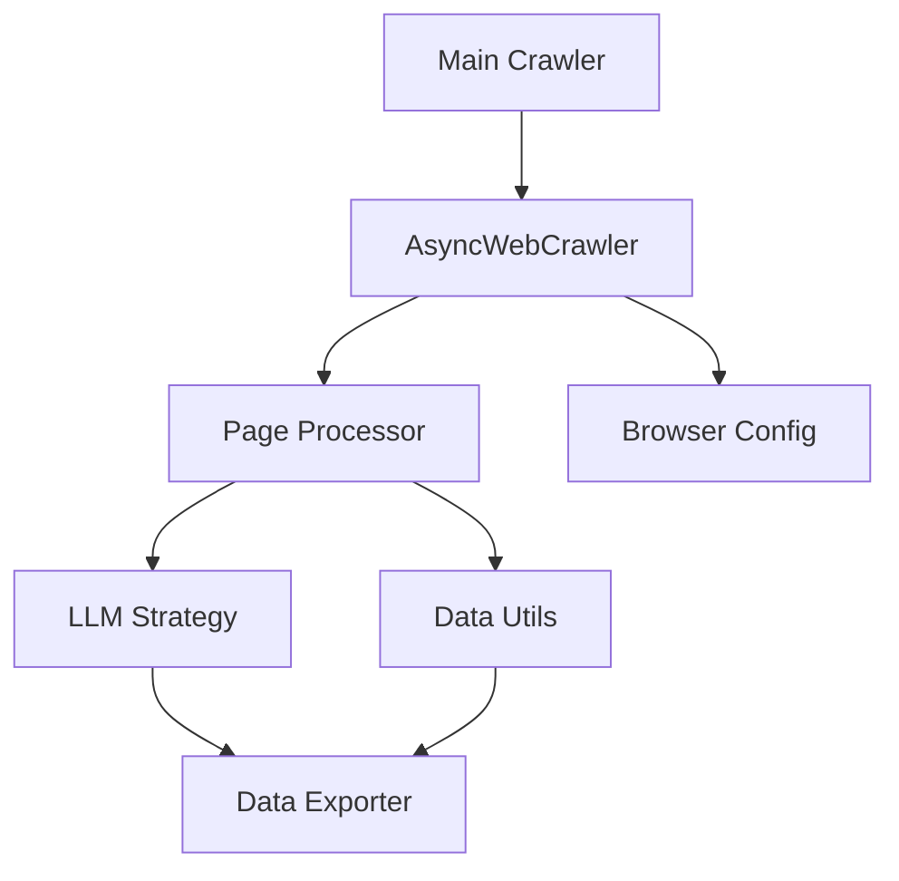

# 🕸️ Deep Seek Crawler

[](https://www.python.org/downloads/)
[](https://github.com/oussemabenhassena5/Crawl4DeepSeek)
[](https://github.com/oussemabenhassena5/Crawl4DeepSeek)
[](LICENSE)

> *Unleashing AI-Powered Web Scraping at Scale* 🚀

## 🎯 What Makes This Special

Deep Seek Crawler represents the next generation of web scraping, combining asyncio's power with DeepSeek's AI capabilities to transform chaotic web data into structured intelligence. Built for performance, scalability, and precision.

## 🔥 Key Features

### Intelligence Layer
- **Smart Pagination**: Autonomous detection of result boundaries and page termination
- **Duplicate Prevention**: Intelligent tracking of seen venues using efficient set operations
- **Polite Crawling**: Built-in rate limiting with configurable sleep intervals
- **Robust Error Handling**: Graceful handling of no-results scenarios

### Engineering Excellence
- **Asynchronous Architecture**: Built on Python's asyncio for maximum performance
- **Modular Design**: Clean separation of concerns with utility modules
- **Session Management**: Persistent crawling sessions with automatic cleanup
- **CSV Export**: Structured data output with comprehensive venue information

## 🏗️ Architecture



## 💻 Technical Implementation

### Core Components
- **AsyncWebCrawler**: High-performance asynchronous crawling engine
- **LLM Strategy**: AI-powered content extraction and processing
- **Browser Configuration**: Customizable crawler behavior settings
- **Data Utilities**: Robust data processing and export functionality

### Performance Features
- **Efficient Memory Usage**: Set-based duplicate detection
- **Controlled Crawling**: Configurable delay between requests
- **Graceful Termination**: Smart detection of crawl completion
- **Usage Statistics**: Built-in LLM strategy usage tracking

## 🚀 Quick Start

1. **Clone & Setup**:
    ```bash
    git clone https://github.com/oussemabenhassena5/Crawl4DeepSeek.git
    cd Crawl4DeepSeek
    python -m venv venv && source venv/bin/activate
    pip install -r requirements.txt
    ```

2. **Configure Environment**:
    ```bash
    # .env file
    GROQ_API_KEY=your_api_key
    ```

3. **Launch Crawler**:
    ```bash
    python crawler.py
    ```

## 📊 Project Structure

```
crawl4deepseek/
├── crawler.py            # Main crawling script
├── config.py            # Configuration settings
├── utils/
│   ├── data_utils.py    # Data processing utilities
│   └── scraper_utils.py # Crawling utility functions
├── requirements.txt     # Project dependencies
└── .env                # Environment configuration
```

## 🛠️ Engineering Highlights

- **Async Processing**: Efficient handling of concurrent page fetches
- **Smart State Management**: Tracking of seen venues and crawl progress
- **Configurable Behavior**: Easy-to-modify crawler settings
- **Comprehensive Logging**: Detailed crawl progress and statistics

## 🔄 Development Workflow

The crawler follows a systematic approach:
1. Initializes configurations and strategies
2. Processes pages asynchronously
3. Checks for duplicate venues
4. Exports structured data
5. Provides usage statistics

## 🎯 Future Roadmap

- [ ] Enhanced error recovery mechanisms
- [ ] Multi-site crawling support
- [ ] Advanced data validation
- [ ] Performance optimization for large-scale crawls

## 🤝 Contributing

Contributions are welcome! Feel free to submit issues and pull requests.

## 📜 License

Distributed under the MIT License. See `LICENSE` for more information.

---

<div align="center">

**Built with 💻 by [Oussema Ben Hassena](https://github.com/oussemabenhassena5)**

*Transforming Web Data into Intelligence*

[LinkedIn](linkedin.com/in/oussema-ben-hassena-b445122a4) 
</div>